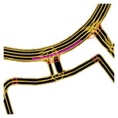
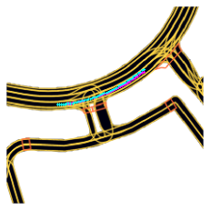
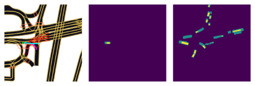

# Lyft Agent movement prediction using Recurrent Neural Networks and Attention 

This repository contains the models that I used in the [Lyft Kaggle](https://www.kaggle.com/c/lyft-motion-prediction-autonomous-vehicles) competition. It is not a top-performing model; its competition score (likelihood) was 190 (top 700).

In contrast to the majority of the competitors' models, I employed RNNs and attempted to follow two Sadeghian publications. I built the models from the ground up, largely for fun and to experiment with recurrent neural networks and attention. I learnt a lot about RNN training, such as trimming gradients during the backward pass rather than at the end, employing stateful units, and applying visual and self attention.

The trained models that were used to replicate my results are available in the TrainedModel directory. They should be decompressed in the repository's root directory.

More work need to be done, such as carefully selecting the training data, constructing a multiple route prediction model, and not depending too much on the previous path. These particulars proved significant.

# Table of Contents
1. [Overview](#Overview)
2. [Code Description](#Code_Description)

# Overview

The competition requires to forecast a given agent's future placements (vehicle, pedestrian, or bike). The forecast has to be 5 seconds in the future. An aerial map of the landscape, a semantic map, the location of the agent in the map, the position of other agents in the map, and the history positions of the agents (approximately 10 seconds in the past) were used as input. This network is planned to be used to predict the future locations of agents in the vicinity of an autonomous vehicle.

Lyft offered a [large dataset](https://self-driving.lyft.com/level5/download/), a [good library](https://github.com/lyft/l5kit), and [documentation](https://lyft.github.io/l5kit/) to train the models. They must both execute this code.

### Results

This library has several models, however I was only able to train one (they take a lot of compute...). The model that was tested was the V2 model with no attention (additional details below). The model's inputs are shaped as follows:

The input semantic map is shown first, followed by the fade image of the Ego agent (the agent to be predicted) and the fade images of the other agents. The historical coordinates are shown in green on the semantic map (the network gets them as value data). This sample's anticipated output is:

when the goal route is shown in pink (? The network produced the following results (in cyan):

Examples:

ok:

under shot:

crashed (it forgot to turn):

ok (here it turned ok, because it was already turning):

### Base model

The basic model is built on the Lyft baseline and is made up of a convolutional network for feature extraction, an average pooling layer, and a fully connected layer for forecasting each subsequent step. The network predicts just a limited number of future steps and ignores previous placements.

The input is a NxN picture with three RGB channels from the semantic or aerial map, one for the present Ego position, one for the current Agents position, and two more for each historical point, with the Ego and Agents positions. The input is supplied into the *Image Encoding Network* (a pre-trained convolutional neural network), and the outputs are averaged to produce a feature tensor, which is then fed into the *Path Decoder Network*, which is made up of two fully connected layers. The result is a coordinate vector with T time steps.

### Model V1

The model V1 is a free interpretation of two papers,  [sadeghian2018car](https://openaccess.thecvf.com/content_ECCV_2018/papers/Amir_Sadeghian_CAR-Net_Clairvoyant_Attentive_ECCV_2018_paper.pdf) and [sadeghian2019sophie](https://arxiv.org/abs/1806.01482). It works by applying a recurrent network to decode the future agent positions, based onf image and history features.

The *History Path Encoding Network* is used in this model to encode the path coordinates and generate a feature tensor. This network can be recurrent or not (if not, the network is essentially a CarNet). The *Image Encoding Network*, a pre-trained convolutional neural network, receives the graphical input and generates a feature map that may be processed by an attention layer (Bahdanau) or average pooled. This data is then input into the *Path Decoder Network*, a recurrent network that calculates the next step coordinates. The *History PAth Encoding Network* feeds the created coordinates back into the network.
This network was a quick test, and I eventually opted to go with the V2 model, although it can simulate a CarNet.

### Model V2

The V2 is the final model (and the most successful of my experiments). It combines the SOPHIE net principle with the ability to use an external speed and acceleration estimate model (MRUV, which stands for Movimiento Rectilineo Uniformemente Variado in Spanish). 

The *History Path Encoding Network*, a recurrent neural network that analyzes the whole history path and creates a tensor of features, processes the history input. Before being sent to the *Path Decoder Network*, the historical characteristics are processed by an attention mechanism (or average pooling). The hidden state of this network was anticipated to be utilized to establish the hidden state of the *Path Decoder Network*, but this is a defect in TensorFlow (when working in graph mode). 
The *picture Encoding Network*, like in model V1, processes the picture input. The picture and history characteristics are combined and supplied into the *Path Decoder Network*. The *Path Decoder Network* can also accept data from the *MRUV estimation model*, which is a neural network that analyzes the feature tensor and attempts to predict the agent's speed and acceleration. The *MRUV estimation model* then gives the *Path Decoder Network* the expected position of the agent if it were following a uniform linear path at each forecasted step. The *MRUV estimation model* is trained using a basic speed and acceleration estimation based on the past route along the path decoder network.

# Code_Description

### Requirements

The training of the model requires:
* CPU RAM >= 16 GB
* GPU RAM >= 12 GB (or more for the Base model)
* CUDA CAPABILITY > 3.6

The training times will largely depend on the CPU speed (GPU for the base model). A solid state storage unit is advised but not required.

The code can be run in an environment with python 3.6.8, jupyter notebook support and the following libraries:

* graphviz==0.14.2
* ipykernel==5.1.3
* ipython==7.11.1
* jupyter==1.0.0
* jupyter-core==4.6.1
* Keras-Applications==1.0.8
* Keras-Preprocessing==1.1.2
* l5kit==1.1.0
* matplotlib==3.1.2
* notebook==6.0.2
* numpy==1.18.1
* opencv-contrib-python-headless==4.4.0.44
* opt-einsum==3.1.0
* Pillow==7.2.0
* pydot==1.4.1
* PyYAML==5.3.1
* scipy==1.4.1
* tensorboard==2.3.0
* tensorflow-gpu==2.3.1
* torch==1.6.0
* torchvision==0.7.0
* tqdm==4.50.2
* zarr==2.5.0

### Training

To train the model execute the training notebook:
* *./AgentPrediction_Train.ipynb*

Using the selected configuration. Three examples are provided:

1. AgentPrediction_config_Baseline.yaml: The baseline of the Lyft competition, a convolutional network with fully connected layers as output (I never had the time to fully train it)

2. AgentPrediction_config_CarNet.yaml: An interpretation of the CarNet paper, [sadeghian2018car](https://openaccess.thecvf.com/content_ECCV_2018/papers/Amir_Sadeghian_CAR-Net_Clairvoyant_Attentive_ECCV_2018_paper.pdf)

3. AgentPrediction_config.yaml: The model V2 net, the one I used to generate my model.

The user can modify the training procedure in many ways:
* Select teacher force modulation across epochs.
* Modulate the learning rate.
* Modulate the number of future steps to train on.
* Select a minimum distance to train on (use only samples with at least X displacement).
* Code new stuff!

The training notebook will generate outputs per-epoch and also create a TensorBoard file.

At the end of the train notebook some plotting functions are provided.

### Testing

The testing of the model is done using the test notebook:

* *./AgentPrediction_Test.ipynb*

It has two main parts, first it generates a submission file for the Kaggle competition (no really useful now) and the second uses the validation dataset to generate a similar chopped dataset as the Test dataset and computes a validation score that is near the test score (sadly is the same data as the validation dataset, but the value is closer to that from the leader board).

To test the provided model set:

* path_load = './output_V2_noAttn_big_multiLoss_imgRetrain_mruvGuided_mruvModel'
* net_base_name = 'epoch_200'

